# Daamin's Keyboard - ShrekBoard

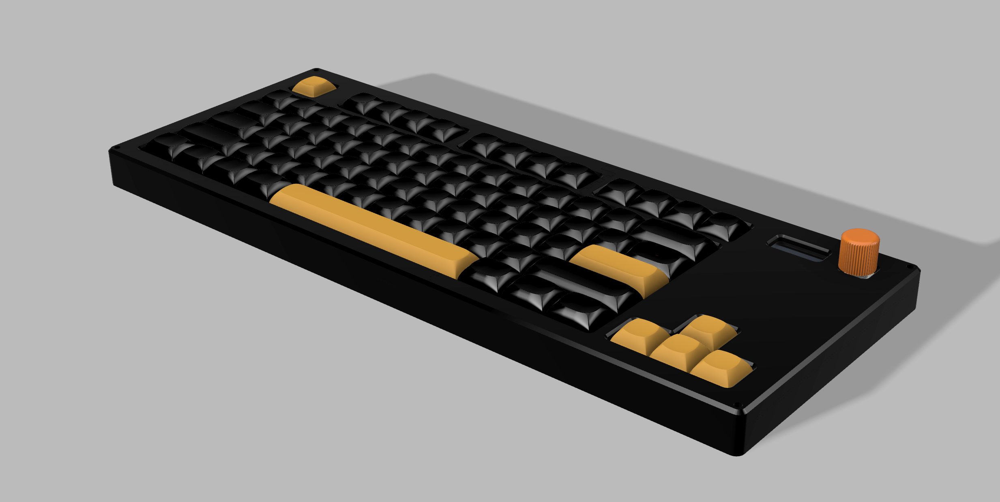

Made by [Daamin](https://daamin.tech)

Features:

- 78x keys!
- TKL Layout minus (9 keys above the arrow keys) and Fn moved to the bottom-left.
- 0.91" OLED for Pictures, Current - Playing Media etc
- EC11 Rotary Encoder - For Volume, Brightness etc
- Hack Club branded PCB
- Raspberry Pico USB-C replacement: [Orpheus Pico](https://orpheuspico.hackclub.com/)
- Comfy Design
- KMK firmware

## Info

I made this keyboard since I was typing a lot, and my laptop's keyboard wasn't gonna cut it. It might prove hazardous to my health over a long period, I also plan to buy a wristrest with this if it suits me.

I also think this is the perfect keyboard, since it has all the useful keys, and an RE + Display. I'll use the RE to control my songs, and the display to show the current playing song. The firmware for it is gonna be so spicy.
Oh and it also looks very nice in my eyes. Took me more than **80 hours** making the PCB, Case and researching for the BOM. I've made so many new changes and spent most of my time on revisions.

## PCB

The PCB's size is 360.4mm x 130.4mm

| Schematic                     |
| ----------------------------- |
|  |

| Front                     |
| ------------------------- |
| 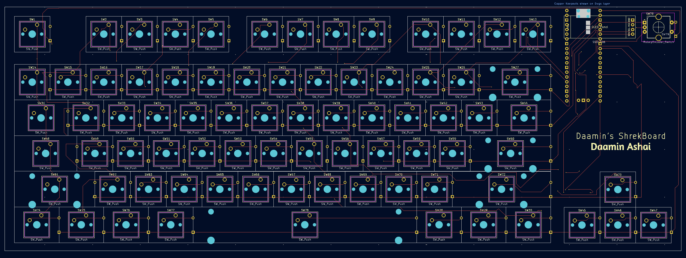 |

| Back                     |
| ------------------------ |
| 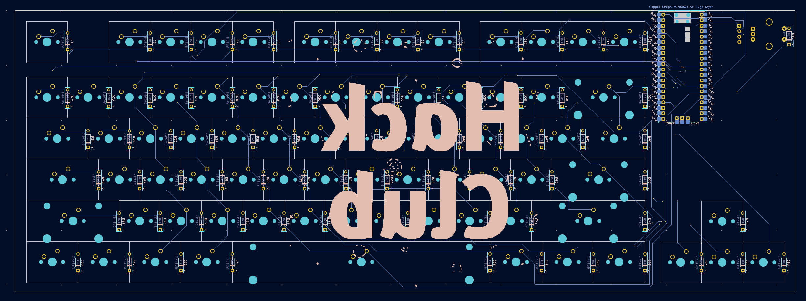 |

| 3D - Front                   |
| ---------------------------- |
| 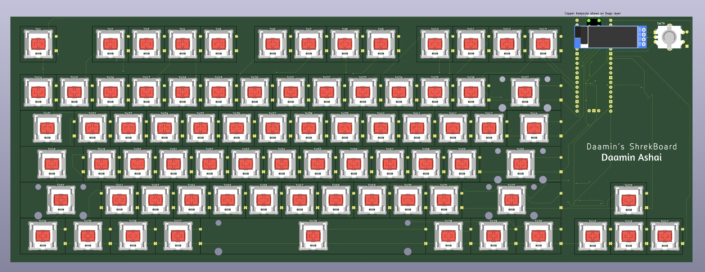 |

| 3D - Back                   |
| --------------------------- |
| 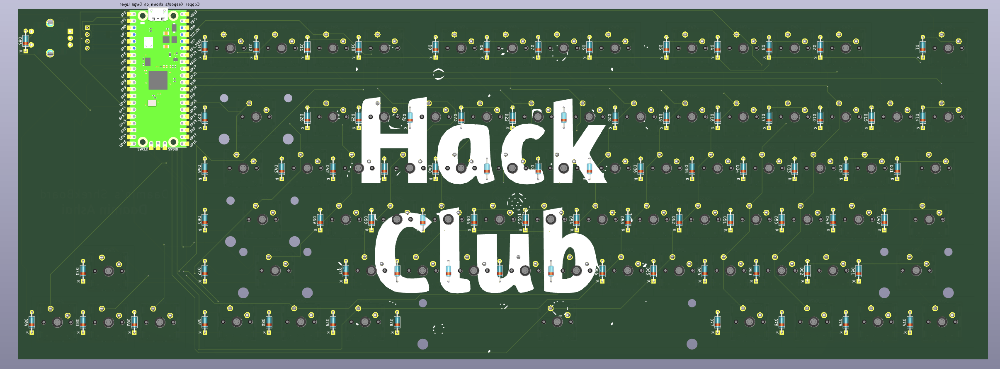 |

## Case

Thickness:-

- Top: 7mm
- Plate: 1.5mm
- Bottom: 11.5mm
- **Total**: 20mm
  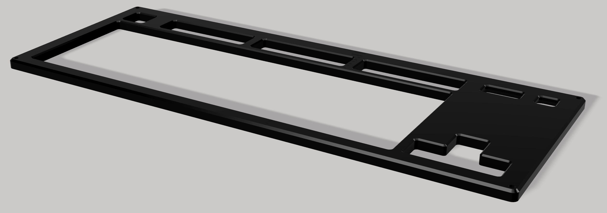
  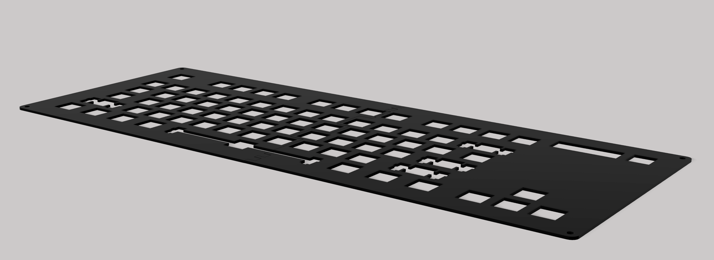
  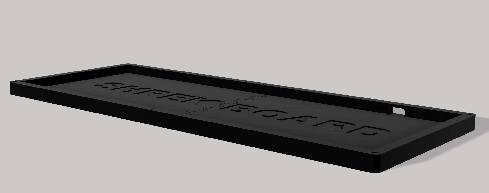
  

The case was made in Fusion360.

I chose to add branding on the bottom case only for aesthetics.
In order for the parts to be 3d printed, they're divided into 2 each.

# Top:

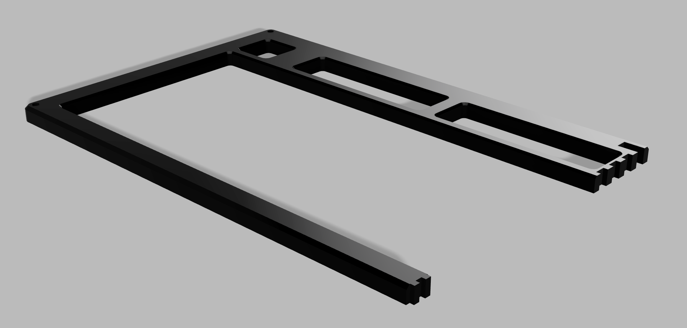
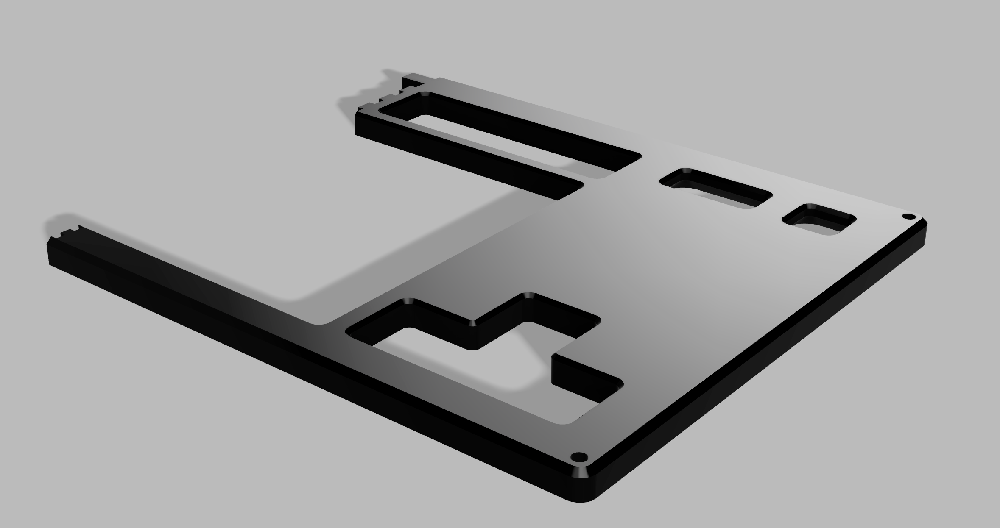

# Middle Plate:

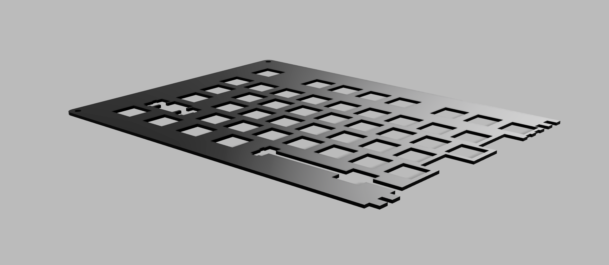

# Bottom:

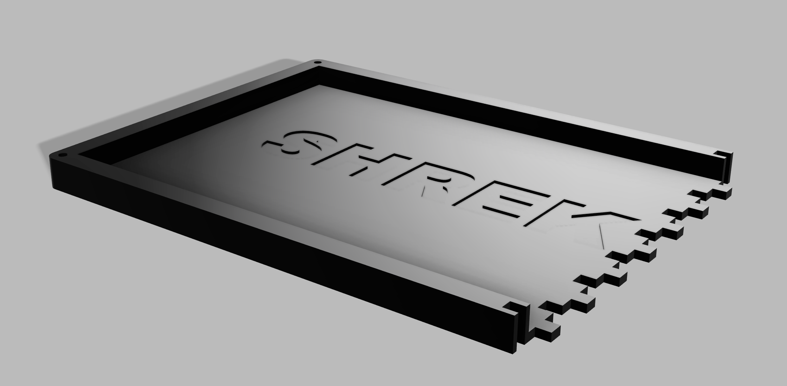
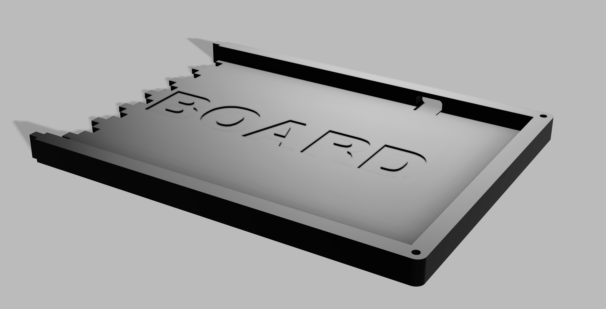

## 3D Render:

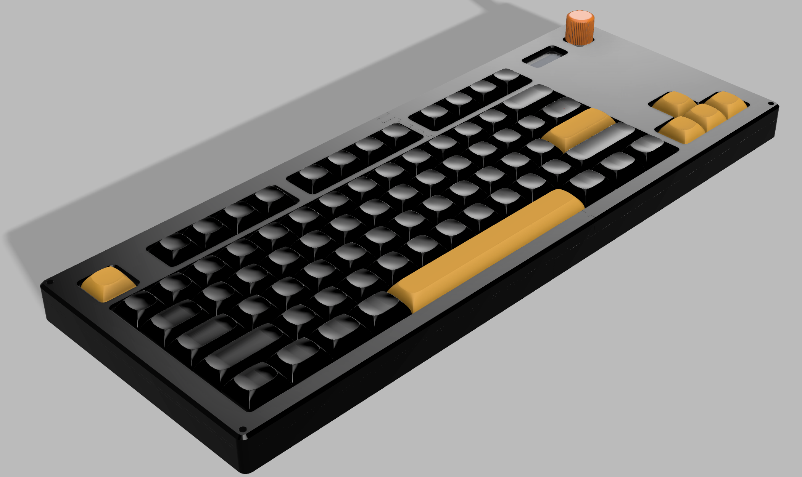

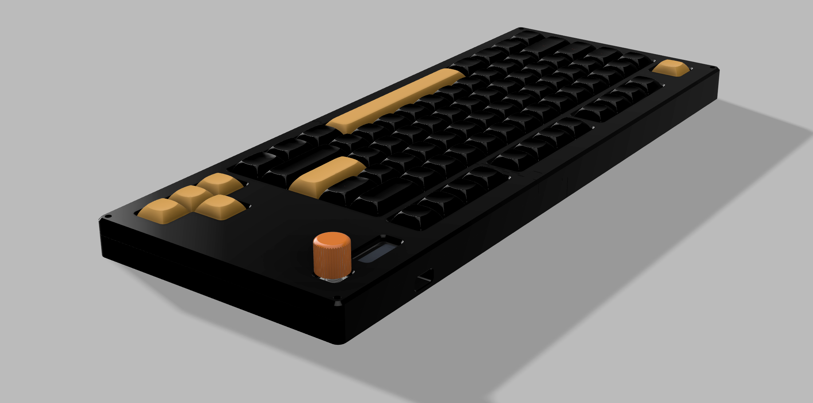
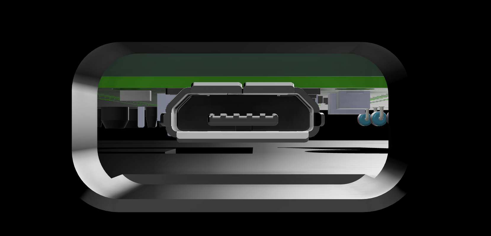
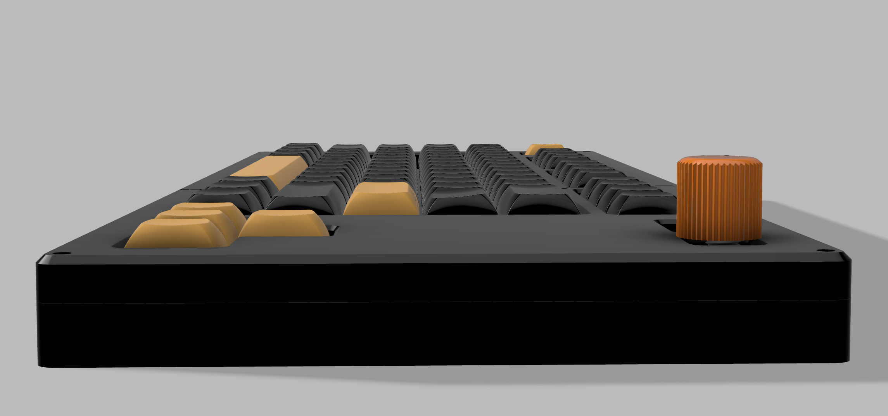
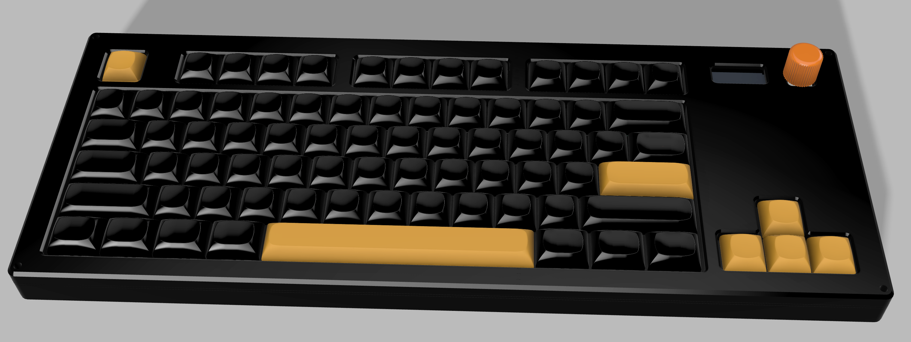
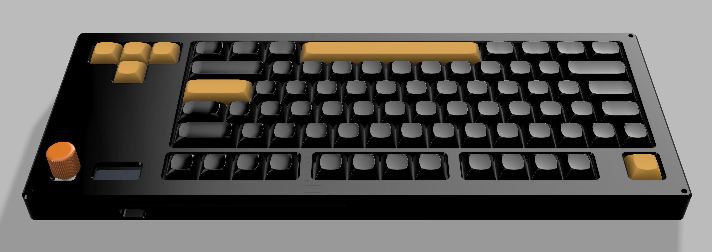
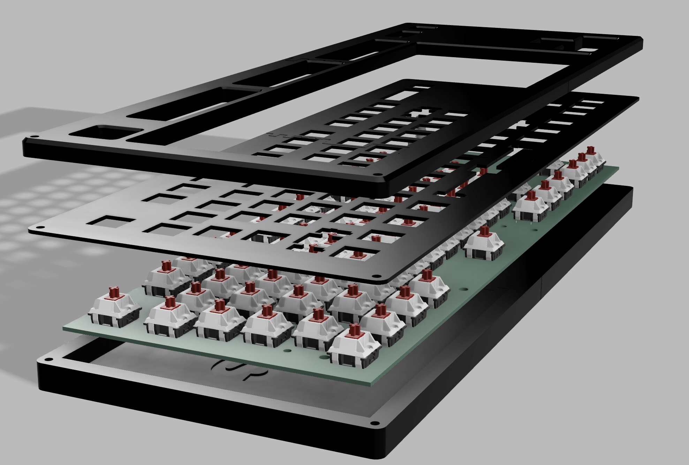
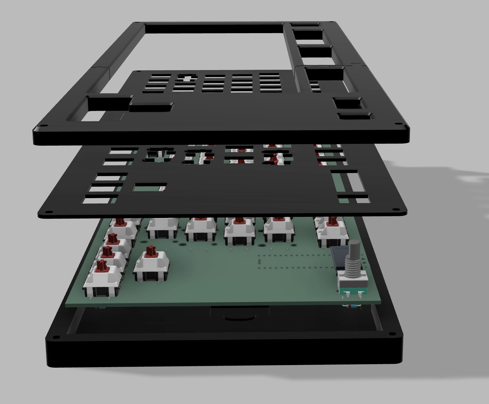

## Layout:

The Layout is a TKL (Tenkey-less) layout with some mods.

- removing Home, End etc island
- removing PrtSc etc island
- moving Fn key to bottom-left

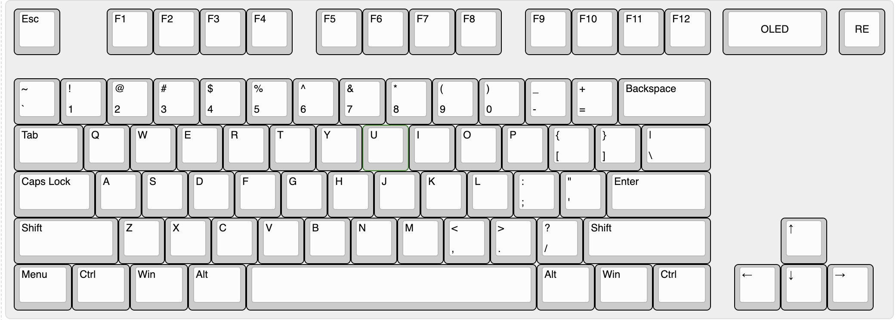

## BOM

| Name                                                          | Qty | Final Price - INR (USD) | Link                                                                                                       |
| ------------------------------------------------------------- | --- | ----------------------- | ---------------------------------------------------------------------------------------------------------- |
| Gateron EF Grayish                                            | 80  | 1560 ($18.19)           | [here](https://neomacro.in/products/gateron-ef-grayish)                                                    |
| Cherry Profile PBT Keycaps                                    | 1   | 1299 ($15.14)           | [here](https://stackskb.com/store/veekos-gradient-keycaps-cherry-profile-135-keys)                         |
| Durock Smokey Screw-In Stabilizers V2 (4+1 w/ 6.25u spacebar) | 1   | 1595 ($18.6)            | [here](https://stackskb.com/store/durock-smokey-screw-in-stabilizers-v2/)                                  |
| Diode 1N4148 Through - Hole                                   | 100 | 169 ($1.97)             | [here](https://amzn.in/d/j3eLvoh)                                                                          |
| 0.91" OLED SSD1306                                            | 1   | 235 ($2.74)             | [here](https://amzn.in/d/3cISYEV)                                                                          |
| EC11 Rotary Encoder                                           | 2   | 178 ($2.08)             | [here](https://amzn.in/d/hVRxzij)                                                                          |
| M3 x 20mm Bolt                                                | 15  | 149 ($1.73)             | [here](https://amzn.in/d/8GRQWAB)                                                                          |
| M3 Nuts                                                       | 8   | 158 ($1.84)             | [here](https://amzn.in/d/7UQtsm8)                                                                          |
| M3 x 5mm Heatset Insert                                       | 25  | 179 ($2.09)             | [here](https://amzn.in/d/ixybuAc)                                                                          |
| PCB - (Black Color)                                           | 5   | 4727($55.11)            | [here](https://hc-cdn.hel1.your-objectstorage.com/s/v3/70f98601e28d2215b7cf86786f0aa80957bd7ae2_image.png) |
| Orpheus Pico                                                  | 1   | From HackClub HQ        |
| Rotary Encoder Knob                                           | 1   | From HackClub HQ        |
| Top Case - 1 (Black "./production/TOP1.step")                 | 1   | Print Legion            |
| Top Case - 2 (Black "./production/TOP2.step")                 | 1   | Print Legion            |
| Middle Plate - 1 (Black "./production/MIDDLE1.step")          | 1   | Print Legion            |
| Middle Plate - 2 (Black "./production/MIDDLE2.step")          | 1   | Print Legion            |
| Bottom Case - 1 (Black "./production/BOTTOM1.step")           | 1   | Print Legion            |
| Bottom Case - 2 (Black "./production/BOTTOM2.step")           | 1   | Print Legion            |

## Total Pricing

The keyboard comes out to be 10,249 INR ($119.49) when adding ordered parts and PCB. Does not include 3D - Printed case, Pico and Knob.
PS:- (Seed Studio costs $142 )
I have chose "air registered mail" over "UPS World Saver" because air registered mail is less likely to get customs even if it is more expensive.

## Notes :-

I want all the six 3D-printed parts to be printed in black color.
^ that includes: TOP1.step, TOP2.step, BOTTOM1.step, BOTTOM2.step, MIDDLE1.step and MIDDLE2.step
I want the 1x Rotary encoder knob as well.

Some of the above items, were ordered in packs due to unavailability of singular items.
The pricing might slightly vary due to flash sales, and dollar market trends.
